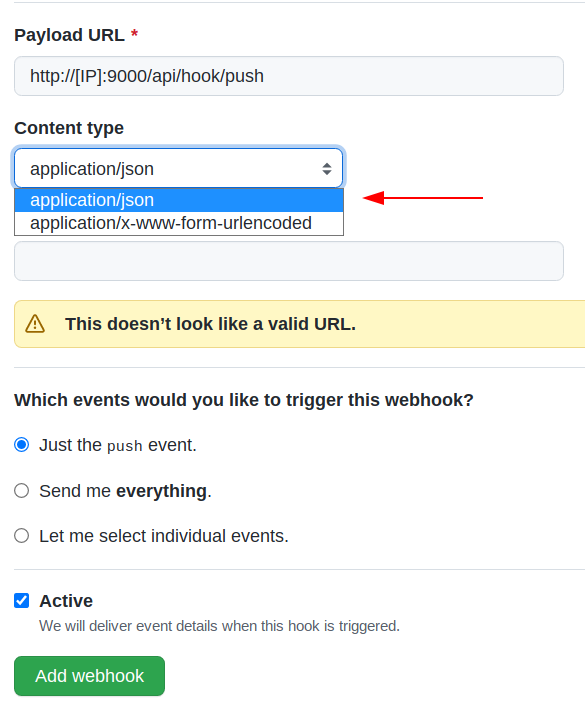

## Required

- [Maven](https://maven.apache.org/download.cgi)

## Clone

- Clone this branch to your local machine using

```shell
$ git clone https://github.com/diff-api/diff-api
```

## Setup

### Installation

> Compile project with Maven

```shell
$ mvn clean package spring-boot:repackage # -DskipTests
```

> Build docker

```shell
$ docker-compose up --build
```

### Configuring VCS

> [Set a webhook](https://docs.github.com/en/developers/webhooks-and-events/webhooks/creating-webhooks)


